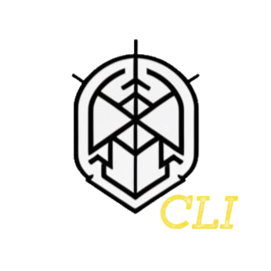

<div align="center">
  
  <h1>MultScan-cli</h1>
  <br/>

  <p><i>MultScan-cli is a command line interface for the MultScan project, created by <a href="https://infosec.exchange/@Pengrey">@Pengrey</a>.</i></p>
  <br />
  
</div>

## Installation

* Run `go build` in the src directory of the project to build the binary.

* Or use the pre-built binary in the bin directory.

```bash
$ cd src
# Build for linux
$ GOOS=linux GOARCH=amd64 go build -o ../bin/multscan-cli_linux

# Build for windows (64-bit)
$ GOOS=windows GOARCH=amd64 go build -o ../bin/multscan-cli_64.exe

# Build for windows (32-bit)
$ GOOS=windows GOARCH=386 go build -o ../bin/multscan-cli_32.exe

# Build for mac
$ GOOS=darwin GOARCH=amd64 go build -o ../bin/multscan-cli_mac
```

## Demo


## Documentation
For more information on how to use the MultScan-cli, check the [documentation](https://multsec.github.io/docs/multscan-cli/)

## License
This project is licensed under the GNU General Public License - see the [LICENSE](LICENSE) file for details.